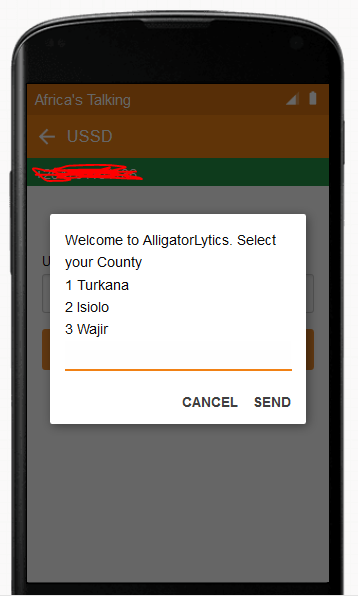
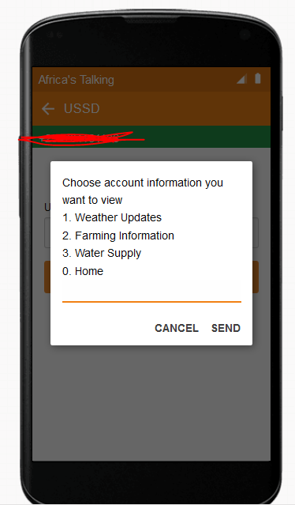
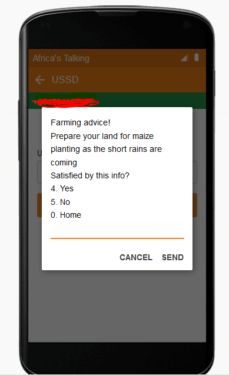

# team-alligator-backend
IBMRA Team Alligator Hackathon

Windows builds must also enable PDO because as of PHP 5.1.0 it depends on it. So, php.ini will end up with something like this:

extension=php_pdo.dll
extension=php_sqlite.dll

## Files : 
1. index.php (main file with ussd commands)
2. sqlitedb.php (extends sqlite class)
3. sqlqueries.php (database queries for create and add records--> generates a .db file)
4. manifest (CLI IMB Cloud configurations)

## APIs
1. [IBM Weather Api](https://console.bluemix.net/docs/services/Weather/index.html "IBM Weather Api")
2. [Africa's Talking USSD Api](http://docs.africastalking.com/ussd "Africa's Talking USSD Api")

## Platforms
1. [Netbeans IDE](https://netbeans.org/ "Netbeans IDE")
2. [IBM Cloud](https://console.bluemix.net/ "IBM Cloud")

## Screen Shots

## Test link
You can make an api call to the php hosted on IBM cloud. Sqlite.db was used for ease of deployment 
on the bluemix platform. 
[AlligatorLytics Api calls](https://alligatorlytics.eu-gb.mybluemix.net/ "AlligatorLytics Api calls")
